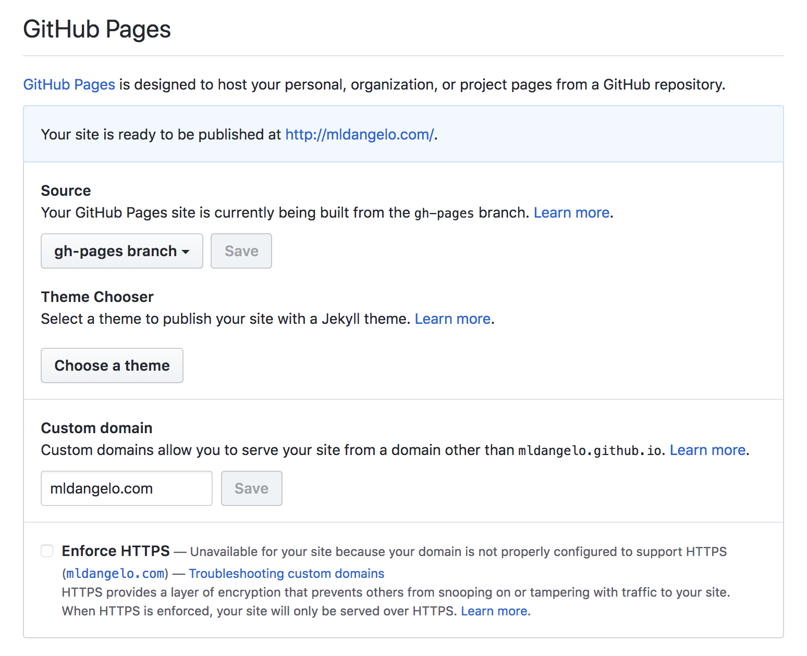

# Adapting this Website

Many people have contacted me about adapting this website. I have tried to make things as simple as possible. There are still bugs. I am sorry. If you find a bug, please email me (help@mldangelo.com), submit a pull request (I'll buy you a coffee as a thank you), or submit an issue.

You may wish to fork this repository or remove my remote origin and add your own. Go [here](https://help.github.com/articles/changing-a-remote-s-url/) for more information on how to change remotes.

## Before you start

1. Make sure you have a good text editor. I recommend [Visual Studio Code](https://code.visualstudio.com/).
1. Review `src/App.js`. This file contains all of our route definitions. If you wish to add or remove a page, you should do so here.

## Checklist

### Setup

1. Run the project before making any modifications by following the set up and running instructions in the main [README.md](https://github.com/mldangelo/personal-site#set-up).
1. Change `homepage` in `package.json` to reflect where you plan to host the site. This is important for static exporting via react-snap. This also changes your path when developing locally. For example, a homepage of `mldangelo.com` places the site at `localhost:3000` and a homepage of `https://mldangelo.github.io/personal-site/` places the site at `localhost:3000/personal-site/`. If you plan to host at on a path such as `https://[your-github-username].github.io/[your-repo-name]`, you should set this now so that your development environment mirrors your production environment.
1. Create a `.env` file. To do this, run:

    ```bash
    cp sample.env .env
    ```

    and set values as appropriate. Most people will not need to modify this file.

### Adapt Content

I recommend keeping the project running as you go (with `npm start`) to help correct mistakes quickly.

1. Start by changing text in the sidebar. This file is located at `src/components/Template/SideBar.js`.
1. Add an image of yourself in `public/images/me.jpg`. Your image should be approximately 256 x 256 pixels. Larger and smaller is ok, but avoid very large images to save bandwidth. If you need help resizing your image, Adobe makes a great online tool [here](https://www.adobe.com/photoshop/online/resize-image.html).
1. Modify the text on the homepage. This file is located at `src/pages/Index.js`.
1. Modify the files in `src/data/resume/` next.
1. Modify all of the other files in the `src/data/` directory.
1. You've finished modifying >95% of the pages. Search through the rest of the files for references to `Michael` or `Angelo` and change values to your name.
1. Change or remove the favicon in `public/index.html`. [This](https://realfavicongenerator.net/) website may be helpful.

### Deploy

See deployment instructions [here](https://github.com/mldangelo/personal-site#deploying-to-github-pages). If you plan to use a custom url, create `public/CNAME` and enter your URL. You can run:

```bash
echo "[your-custom-domain][.com]" > public/CNAME
```

as a shortcut.

I recommend purchasing your own domain name from [Google Domains](https://domains.google). If you would like to host on github pages, run `npm run deploy`. This generates a new branch called `gh-pages`. Then go to `https://github.com/[your-github-username]/[your-repo-name]/settings` and configure accordingly:

<center></center>

Next, configure your domains DNS record. See [here](https://help.github.com/articles/using-a-custom-domain-with-github-pages/) for more information. After a few minutes, your website should be live on your domain.

That's it. Thank you for reading. If you go through this guide and run into issues or areas you find unclear, please consider submitting a PR to help others like you.
